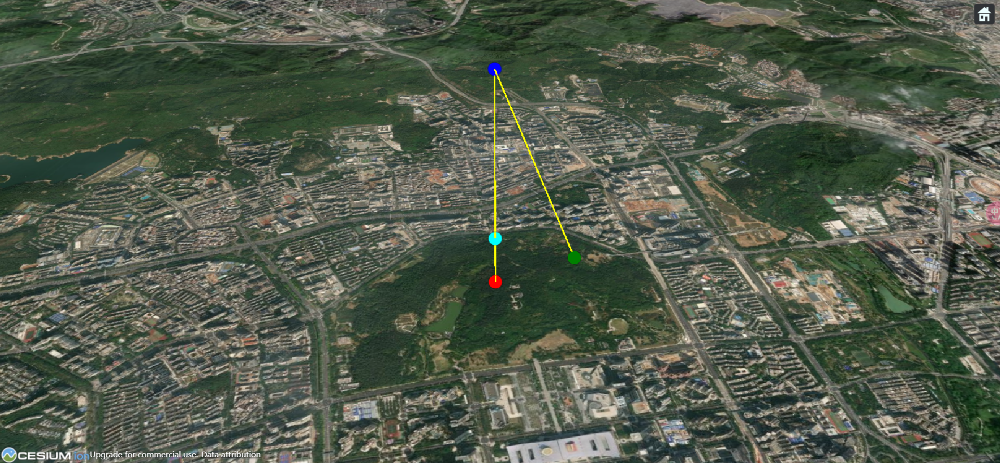

# Cesium 中如何根据位置、方位（朝向）和间距绘制另一个点

> 在开发 Cesium 过程中，我曾经遇到过根据当前点的位置、方位（朝向）和间距来绘制另一个点？虽然这个问题很简单，但是毕竟是亲身开发经历遇到过的问题，于是记录整理了这篇文章（当作是成长的脚印）。
>
> - [查看地址](https://cesium-entity-model.vercel.app/)
> - [仓库地址](https://github.com/WaterSeeding/CesiumEntityModel)

## 效果



如图所示，青色圆点作为原点，然后，我向下 300 米绘制了红色圆点，向上 1000 米绘制了蓝色圆点，最后垂直向上 1000 米，向后 1600 米绘制绿色圆点。

## 过程

1. 获取 CesiumJS 核心类`Cesium.Viewer`:

```tsx
const viewer = new Cesium.Viewer(cesiums.current, {
  contextOptions: {
    webgl: {
      alpha: true,
    },
  },
  selectionIndicator: false,
  animation: false, //是否显示动画控件
  baseLayerPicker: false, //是否显示图层选择控件
  geocoder: false, //是否显示地名查找控件
  timeline: false, //是否显示时间线控件
  sceneModePicker: false, //是否显示投影方式控件
  navigationHelpButton: false, //是否显示帮助信息控件
  infoBox: false, //是否显示点击要素之后显示的信息
  fullscreenButton: false,
});
viewerRef.current = viewer;
```

2. 确定原点坐标：

```tsx
let center = Cesium.Cartesian3.fromDegrees(114.0535, 22.557904, 300);
```

3. 根据原点，向下 300 米绘制了红色圆点：

```tsx
// 从具有东北向上轴的参考帧计算4x4变换矩阵以提供的原点为中心，以提供的椭球的固定参考系为中心。
let matrix = Cesium.Transforms.eastNorthUpToFixedFrame(center);
// 创建围绕z轴的旋转矩阵
let mx = Cesium.Matrix3.fromRotationX(Cesium.Math.toRadians(-90));
// 从Matrix3计算代表旋转的Matrix4实例和代表翻译的Cartesian3
let rotationX = Cesium.Matrix4.fromRotationTranslation(mx);
// 计算两个矩阵(matrix * rotationX)的乘积
Cesium.Matrix4.multiply(matrix, rotationX, matrix);
let redResult = Cesium.Matrix4.multiplyByPoint(
  matrix,
  new Cesium.Cartesian3(0, 300, 0),
  new Cesium.Cartesian3(),
);

setPoint(viewer, redResult, Cesium.Color.RED);
```

4. 根据原点，向上 1000 米绘制了蓝色圆点:

```tsx
let matrix = Cesium.Transforms.eastNorthUpToFixedFrame(center);
let mx = Cesium.Matrix3.fromRotationX(Cesium.Math.toRadians(90));
let rotationX = Cesium.Matrix4.fromRotationTranslation(mx);
Cesium.Matrix4.multiply(matrix, rotationX, matrix);
let blueResult = Cesium.Matrix4.multiplyByPoint(
  matrix,
  new Cesium.Cartesian3(0, 1000, 0),
  new Cesium.Cartesian3(),
);

setPoint(viewer, blueResult, Cesium.Color.BLUE);
```

5. 根据原点，垂直向上 1000 米，向后 1600 米绘制绿色圆点:

> 这里的垂直向上 1000 米，和绘制蓝色原点重合了，所以我在此基础上，来绘制绿点

```tsx
let matrix = Cesium.Transforms.eastNorthUpToFixedFrame(blueResult);
let mx = Cesium.Matrix3.fromRotationX(Cesium.Math.toRadians(180));
let rotationX = Cesium.Matrix4.fromRotationTranslation(mx);
Cesium.Matrix4.multiply(matrix, rotationX, matrix);
let greenResult = Cesium.Matrix4.multiplyByPoint(
  matrix,
  new Cesium.Cartesian3(0, 1600, 0),
  new Cesium.Cartesian3(),
);

setPoint(viewer, greenResult, Cesium.Color.GREEN);
```

## 知识点补充

1. Cesium.Transforms.eastNorthUpToFixedFrame

通过调用 `Cesium.Transforms.eastNorthUpToFixedFrame(enuPoint)`，将该点从东北天(East-North-Up，ENU)坐标系转换到固定坐标系，并得到一个变换矩阵 fixedFrameMatrix。

> 固定坐标系通常是一个全局坐标系，例如地球的固定坐标系可以是地球的惯性坐标系。

<br />

2. Cesium.Matrix3.fromRotationX

`Cesium.Matrix3.fromRotationX` 方法是 Cesium JavaScript 库中的一个函数，用于创建一个绕 X 轴旋转的 3x3 旋转矩阵。

> 在三维图形学中，旋转矩阵用于描述对象或坐标系绕某个轴旋转的变换。
>
> `Cesium.Matrix3.fromRotationX` 方法接收一个表示旋转角度的参数，并返回一个旋转矩阵，用于绕 X 轴进行旋转变换。

<br />

3. Cesium.Matrix4.fromRotationTranslation

`Cesium.Matrix4.fromRotationTranslation` 方法是 Cesium JavaScript 库中的一个函数，用于创建一个旋转平移变换的 4x4 变换矩阵。

> 在三维图形学中，变换矩阵用于描述对象在三维空间中的旋转、平移和缩放等变换操作。
>
> `Cesium.Matrix4.fromRotationTranslation` 方法接收一个旋转矩阵和平移向量作为参数，并返回一个包含旋转和平移变换的 4x4 变换矩阵。

<br />

4. Cesium.Matrix4.multiply

`Cesium.Matrix4.multiply` 方法是 Cesium JavaScript 库中的一个函数，用于计算两个 4x4 矩阵的乘积。

> 在三维图形学中，矩阵乘法用于组合多个变换操作。 `Cesium.Matrix4.multiply` 方法接收两个 Cesium.Matrix4 对象作为参数，并返回它们的乘积结果，即一个新的 4x4 矩阵。

<br />

5. Cesium.Matrix4.multiplyByPoint

`Cesium.Matrix4.multiplyByPoint` 方法是 Cesium JavaScript 库中的一个函数，用于将一个 4x4 变换矩阵与一个三维点进行相乘操作。

> 在三维图形学中，矩阵乘法用于将点或向量应用于变换矩阵。
>
> `Cesium.Matrix4.multiplyByPoint` 方法接收一个 Cesium.Cartesian3 对象表示的三维点和一个 Cesium.Matrix4 对象表示的变换矩阵作为参数，并返回一个新的 Cesium.Cartesian3 对象，表示将点应用于变换矩阵后的结果。

<br />

## 相关资料

- [Cesium](https://cesium.com/)
- [Cesium Documentation](https://cesium.com/docs/)
