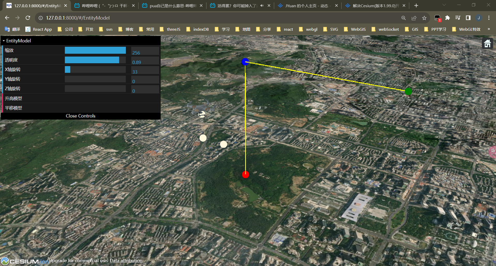

# Cesium 中如何垂直抬升、水平移动、旋转模型

> 在开发 Cesium 过程中，我曾经遇到过垂直抬升、水平移动当前模型的位置？以及如何根据旋转角度旋转模型？解决后，虽然发现这些问题很简单，但是毕竟是亲身开发经历遇到过的问题，于是记录整理了这篇文章（当作是成长的脚印）。
>
> - [查看地址](https://cesium-entity-model.vercel.app/)
> - [仓库地址](https://github.com/WaterSeeding/CesiumEntityModel)

## 效果



如图所示，我首先将模型放大到 256 倍，设置透明度为 0.89，然后旋转模型，最后水平移动模型两个单位，垂直抬升模型一个单位。

## 过程

1. 获取 CesiumJS 核心类`Cesium.Viewer`:

```tsx
const viewer = new Cesium.Viewer(cesiums.current, {
  contextOptions: {
    webgl: {
      alpha: true,
    },
  },
  selectionIndicator: false,
  animation: false, //是否显示动画控件
  baseLayerPicker: false, //是否显示图层选择控件
  geocoder: false, //是否显示地名查找控件
  timeline: false, //是否显示时间线控件
  sceneModePicker: false, //是否显示投影方式控件
  navigationHelpButton: false, //是否显示帮助信息控件
  infoBox: false, //是否显示点击要素之后显示的信息
  fullscreenButton: false,
});
viewerRef.current = viewer;
```

2. 加载 CesiumJS 模型`Cesium.ModelGraphics`:

```tsx
const modelEntity = viewer.entities.add({
  position: position,
  model: {
    uri: './static/model/npc/SM_XMH_EM_WRJ_01_GLB.glb',
    heightReference: Cesium.HeightReference.RELATIVE_TO_GROUND,
    scale: 128,
    maximumScale: 256,
  },
});
```

3. 通过`modelEntity.model!.scale`缩放属性，来缩放模型：

```tsx
modelEntity.model!.scale = new Cesium.ConstantProperty(value);
```

4. 通过`entity.model!.color`颜色属性，来透明化模型:

```tsx
let color = Cesium.Color.WHITE.withAlpha(value);
entity.model!.color = new Cesium.ConstantProperty(color);
```

5. 通过`entity.orientation`朝向属性，来旋转模型：

> 这里主要通过修改模型的方位、倾斜度、翻转来旋转模型。

```tsx
const origin = entity.position?.getValue(new Cesium.JulianDate());
const heading = Cesium.Math.toRadians(rotateX);
const pitch = Cesium.Math.toRadians(rotateY);
const roll = Cesium.Math.toRadians(rotateZ);

const hpr = new Cesium.HeadingPitchRoll(heading, pitch, roll);
const orientation = Cesium.Transforms.headingPitchRollQuaternion(origin!, hpr);
entity.orientation = new Cesium.ConstantProperty(orientation);
```

6. 垂直抬升模型：

```tsx
const setByDirectionAndHeight = (
  position: Cesium.Cartesian3,
  angle: number,
  height: number,
) => {
  // 从具有东北向上轴的参考帧计算4x4变换矩阵以提供的原点为中心，以提供的椭球的固定参考系为中心。
  let matrix = Cesium.Transforms.eastNorthUpToFixedFrame(position);
  // 创建围绕z轴的旋转矩阵
  let mx = Cesium.Matrix3.fromRotationX(Cesium.Math.toRadians(angle || 0));
  // 从Matrix3计算代表旋转的Matrix4实例和代表翻译的Cartesian3
  let rotationX = Cesium.Matrix4.fromRotationTranslation(mx);
  // 计算两个矩阵(matrix * rotationX)的乘积
  Cesium.Matrix4.multiply(matrix, rotationX, matrix);
  let result = Cesium.Matrix4.multiplyByPoint(
    matrix,
    new Cesium.Cartesian3(0, height, 0),
    new Cesium.Cartesian3(),
  );
  return result;
};
```

```tsx
const origin = entity.position?.getValue(new Cesium.JulianDate());
const position = setByDirectionAndHeight(origin!, 90, height);
entity.position = new Cesium.ConstantPositionProperty(position);
```

7. 水平移动模型：

```tsx
const setByDirectionAndLen = (
  position: Cesium.Cartesian3,
  angle: number,
  len: number,
) => {
  // 从具有东北向上轴的参考帧计算4x4变换矩阵以提供的原点为中心，以提供的椭球的固定参考系为中心。
  let matrix = Cesium.Transforms.eastNorthUpToFixedFrame(position);
  // 创建围绕z轴的旋转矩阵
  let mz = Cesium.Matrix3.fromRotationZ(Cesium.Math.toRadians(angle || 0));
  // 从Matrix3计算代表旋转的Matrix4实例和代表翻译的Cartesian3
  let rotationZ = Cesium.Matrix4.fromRotationTranslation(mz);
  // 计算两个矩阵(matrix * rotationZ)的乘积
  Cesium.Matrix4.multiply(matrix, rotationZ, matrix);
  let result = Cesium.Matrix4.multiplyByPoint(
    matrix,
    new Cesium.Cartesian3(0, len, 0),
    new Cesium.Cartesian3(),
  );
  return result;
};
```

```tsx
const origin = entity.position?.getValue(new Cesium.JulianDate());
const position = setByDirectionAndLen(origin!, 0, length);
entity.position = new Cesium.ConstantPositionProperty(position);
```

## 知识点补充

本篇涉及的知识点和我之前写得文章一样，请查阅[Cesium 中如何根据位置、方位（朝向）和间距绘制另一个点](https://juejin.cn/post/7271518821818056759)

## 相关资料

- [Cesium](https://cesium.com/)
- [Cesium Documentation](https://cesium.com/docs/)
